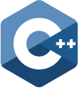
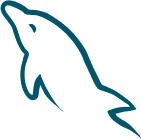

<p> Hi there 👋</p>

<table>
<thead>
<th>
  
</th>
<th></th>
  <th></th>
</thead>
</table>
<hr>

### Badges
[](#) 
[
[](#)
[](#)
<hr>
###Community Badge
<a href="https://twitter.com/osamaayub9" > </a>
  <hr>
 ###![(ConnectWith me)]
 <thead>
  <br>
 <a href="https://www.twitter.com/in/osamaayub9/"></a> &nbsp;&nbsp;&nbsp;&nbsp;
 <a href="https://www.instagram.com/ayub.683/"></a> &nbsp;&nbsp;&nbsp;&nbsp;
 <a href="https://www.linkedin.com/in/osama-ayub-9aba58175/"></a> &nbsp;&nbsp;&nbsp;&nbsp;
 <a href="https://www.youtube.com/channel/UC56Q2bWaSRApOoBv877W2Dg"> </a> &nbsp;&nbsp;&nbsp;&nbsp;
  <a href="https://www.facebook.com/profile/Osama Ayub/"></a> &nbsp;&nbsp;&nbsp;&nbsp
  
  <p>  </p>

  <br>

#### Profile Visits 

<br>
 #### Coding Stats

<!--START_SECTION:osamaayub-->
```text
C++ Language        1 hr 50 mins    ██▒░░░░░░░░░░░░░░░░░░░░░░   09.61 % 
C Language          1 hr 27 mins    ██░░░░░░░░░░░░░░░░░░░░░░░   07.63 % 
python               1 hr 20 mins        ░░░░░░░░░░░░░░░░░░░░░░░░░   00.19 % 
HTML                1 hr 10 mins
```
<!--END_SECTION:osamaayub-->
  
<table>

  <thead>
    <td>Languages</td>
    <td></td>
    <td></td>
    <td></td>
     <td></td>
    <td></td>
    <td></td>
    <td></td>
    <td></td>
     </thead>

  <tr>
    <td>Database</td>
    <td></td>
     <td></td>
     <td></td>
  </tr>
  


