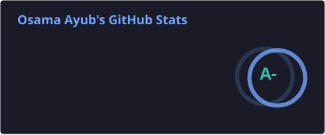
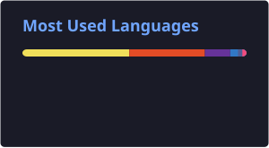

<div align="center">


<a href="mailto:osama.ayubwebdev@gmail.com"></a>
<a href="https://www.linkedin.com/in/osama-ayub8889993755979/"></a>
<a href="https://personal-portfolio-two-taupe-76.vercel.app/"></a>
<a href="https://www.leetcode.com/samayub"></a>
<a href="https://personal-portfolio-two-taupe-76.vercel.app/CV.pdf"></a>

<br><br>


<br>


<br><br>

<kbd><a href="#-about-me">About</a></kbd> •
<kbd><a href="#-impact--key-metrics">Impact</a></kbd> •
<kbd><a href="#-work-experience">Experience</a></kbd> •
<kbd><a href="#-featured-projects">Projects</a></kbd> •
<kbd><a href="#-technical-skills">Skills</a></kbd> •
<kbd><a href="#-github-engagement--analytics">GitHub Activity</a></kbd> •
<kbd><a href="#-connect--hire">Contact</a></kbd>

</div>

<br>


## 👋 About Me

<table>
<tr>
<td width="58%" valign="top">

I'm a **Software Engineer** with **2 years of experience** shipping production **React, Next.js, and Node.js** applications across two companies — **SensViz** and **Cogilent Solutions** — plus a MERN stack internship at **IIFATECH**. I own features end-to-end: frontend components, REST APIs, database schemas, auth, and performance.

**What I bring:**
- 🔩 Full-stack ownership — from schema design to deployment
- ⚡ Measurable performance work — query optimization, indexing, bundle size cuts, memoization
- 🔐 Auth & RBAC systems shipped for 1,000+ real users
- 🧩 Clean, typed, testable code inside 2-week Agile sprints

**Right now:** deepening Next.js App Router & TypeScript expertise, and actively interviewing for Full-Stack / Frontend Engineer roles.

> *"Clean code, measurable impact, seamless developer experience."*

</td>
<td width="42%" align="center" valign="middle">

```ts
const osama: EngineerProfile = {
  name: "Osama Ayub",
  role: "Full-Stack Software Engineer",
  location: "Lahore, PK 🇵🇰",
  experience: "1+ years",
  coreStack: [
    "React", "Next.js",
    "TypeScript", "Node.js",
    "Express", "MongoDB",
  ],
  focus: [
    "API performance",
    "Auth & access control",
    "Scalable architecture",
  ],
  status: "Open to full-time roles 🚀",
};
```

</td>
</tr>
</table>

<br>


## 📊 Impact & Key Metrics

<div align="center">

| Metric | Result | Context |
|---|---|---|
| 🧭 Navigation Complaints | **-40%** | Redesigned Settings page & Sidebar for 500+ users across 2 roles — SensViz |
| ⚡ Server Response Time | **-40%** | Redesigned REST API layer + MongoDB indexing — Equigenix |
| 🔍 Data Lookup Time | **-50% to -60%** | Built sortable/filterable search UIs (Test Library, Equigenix data tables) |
| 📦 Frontend Bundle Size | **-25%** | Code-splitting, lazy loading, memoization — Cogilent Solutions |
| 🔐 Unauthorized Access Attempts | **-30%** | Integrated Clerk role-based auth in 4 weeks — Cogilent Solutions |
| 📈 Avg. Session Duration | **+20%** | Rebuilt BrightSpyre portal on Next.js for 1,000+ MAU — Cogilent Solutions |
| 🐛 Post-Release Defects | **-20%** | Introduced structured code review across 4 sprint releases — SensViz |

</div>

<br>


## 💼 Work Experience

### **Software Engineer** · SensViz
📍 Lahore, PK  ·  🗓️ Aug 2025 – Jul 2026

- Led a **TypeScript-based redesign** of the Settings page and Sidebar for **500+ users**, cutting navigation-related complaints by **40%** across 2 user roles
- Rebuilt category-switching logic with **React Hooks**, reducing page refresh time by **30%** and eliminating unnecessary re-renders
- Built a sortable, filterable **Test Library** with live search for organizer workflows, shrinking data lookup time by **50%**
- Introduced structured code reviews in 2-week Agile sprints, contributing to a **20% drop in post-release defects** across 4 consecutive releases
- **Stack:** React · TypeScript · Next.js · REST APIs

### **Associate Software Engineer** · Cogilent Solutions
📍 Islamabad, PK  ·  🗓️ Feb 2025 – Jan 2026

- Rebuilt the **BrightSpyre portal** on Next.js, growing average session duration by **20%** among **1,000+ monthly active users**
- Integrated **Clerk role-based authentication**, reducing unauthorized access attempts by **30%** within 4 weeks
- Cut frontend bundle size by **25%** through code-splitting, lazy loading, and memoization of high-frequency React components
- **Stack:** Next.js · React · Clerk Auth · Performance Tooling

<details>
<summary><b>+ MERN Stack Developer (Intern) · IIFATECH</b> — Aug 2024 – Oct 2024</summary>
<br>

- Developed and deployed a responsive full-stack job board in 8 weeks using React, Node.js, Express.js, and MongoDB
- Built secure JWT authentication and RESTful APIs with input validation, supporting 10+ concurrent users at zero downtime
- **Stack:** React · Node.js · Express.js · MongoDB · JWT

</details>

<br>


## 🚀 Featured Projects

<table>
<tr>
<td width="50%" valign="top">

### 🔗 Equigenix
Web platform for Arabian horse judges to train, test, and analyze their performance in show competitions.

- Redesigned the **REST API layer** and added **MongoDB indexing**, cutting average server response time by **40%**
- Built paginated data tables for **500+ records** with multi-field filtering and instant search, cutting lookup time by **60%**
- Added real-time pending/rejected invite status indicators for **100+ users**, removing 3 manual organizer steps

`React` `TypeScript` `Node.js` `Express` `MongoDB` `AWS`

[**Live Demo**](https://app.staging.equijudge.ai/)

</td>
<td width="50%" valign="top">

### 🔗 JobLane
MERN-stack job portal — job seekers browse & apply for roles; employers post openings and manage applications.

- Built the full **REST API + auth flow** for two distinct user roles (seeker / employer)
- End-to-end MERN implementation: React frontend, Express/Node backend, MongoDB persistence

`React` `Node.js` `Express` `Tailwind` `MongoDB`

[**Source**](https://github.com/osamaayub/JobLane)

</td>
</tr>
<tr>
<td width="50%" valign="top">

### 🔗 Hair Transplant Lead Management System
Clinic operations tool for patient registration, appointment scheduling, treatment tracking, and inventory.

- Secured **200+ accounts** with a token-based password reset flow (15-min expiry + email verification)
- Shipped a fully responsive UI across 5 Tailwind breakpoints, hitting consistent usability on **95%+** of device types
- Diagnosed and fixed a critical lead-creation bug within **24 hours**, unblocking 30+ barbers

`React` `Node.js` `Express` `MongoDB` `Tailwind CSS`

</td>
<td width="50%" valign="top">

### 🔗 3D Developer Portfolio
Personal portfolio site built to showcase work through an interactive, animated 3D interface.

- Built with **Three.js** for 3D scenes and **Framer Motion** for interaction/animation
- Fully responsive, TypeScript-typed React app deployed on Netlify

`React` `TypeScript` `Tailwind` `Three.js` `Framer Motion`

[**Live Demo**](https://osamaayubportfoliowebsite.netlify.app/) · [**Source**](https://github.com/osamaayub/3D-Developer-Portfolio)

</td>
</tr>
</table>

<br>


## 🛠️ Technical Skills

<div align="center">

**Languages**
<br>


**Frontend**
<br>


**Backend & Auth**
<br>


**Databases**
<br>


**Cloud, Tools & Workflow**
<br>


</div>

<br>


## 📈 GitHub Engagement & Analytics

<div align="center">



## 📬 Connect & Hire

<div align="center">

I'm currently **open to Full-Stack / Frontend Software Engineer roles** — full-time, remote or Lahore-based. If you're hiring or just want to talk shop about performance optimization or system design, reach out.

<a href="mailto:osama.ayubwebdev@gmail.com"></a>
<a href="https://www.linkedin.com/in/osama-ayub8889993755979/"></a>
<a href="https://personal-portfolio-two-taupe-76.vercel.app/CV.pdf"></a>

</div>

<br>

